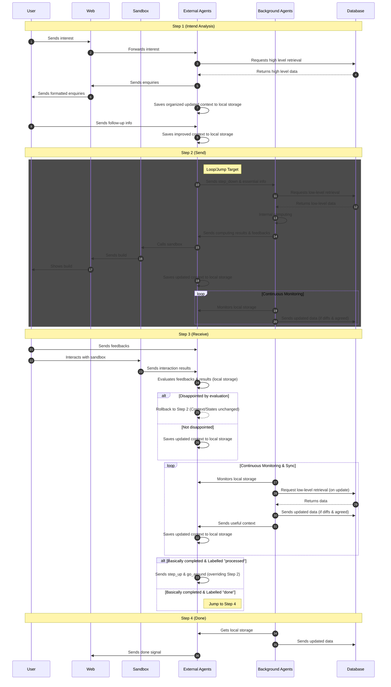

## 1. Use Case

```mermaid
sequenceDiagram
    autonumber
    participant c1 as User
    participant c2 as Web
    participant c3 as Sandbox
    participant c4 as External Agents
    participant c5 as Background Agents
    participant c6 as Database

    Note over c1, c6: Step 1 (Intend Analysis)
    c1->>c2: Sends interest
    c2->>c4: Forwards interest
    c4->>c6: Requests high level retrieval
    c6-->>c4: Returns high level data
    c4->>c2: Sends enquiries
    c2->>c1: Sends formatted enquiries
    c4->>c4: Saves organized updated context to local storage
    c1->>c4: Sends follow-up info
    c4->>c4: Saves improved context to local storage

    Note over c1, c6: Step 2 (Send)
    rect rgb(75, 75, 75)
        Note right of c4: Loop/Jump Target
        c4->>c5: Sends step_down & essential info
        c5->>c6: Requests low-level retrieval
        c6-->>c5: Returns low-level data
        c5->>c5: Internal computing
        c5->>c4: Sends computing results & feedbacks
        c4->>c3: Calls sandbox
        c3->>c2: Sends build
        c2->>c1: Shows build
        c4->>c4: Saves updated context to local storage
        loop Continuous Monitoring
            c5->>c4: Monitors local storage
            c5->>c6: Sends updated data (if diffs & agreed)
        end
    end

    Note over c1, c6: Step 3 (Receive)
    c1->>c4: Sends feedbacks
    c1->>c3: Interacts with sandbox
    c3->>c4: Sends interaction results
    c4->>c4: Evaluates feedbacks & results (local storage)

    alt Disappointed by evaluation
        c4-->>c4: Rollback to Step 2 (Context/States unchanged)
    else Not disappointed
        c4->>c4: Saves updated context to local storage
    end

    loop Continuous Monitoring & Sync
        c5->>c4: Monitors local storage
        c5->>c6: Request low-level retrieval (on update)
        c6-->>c5: Returns data
        c5->>c6: Sends updated data (if diffs & agreed)
        c5->>c4: Sends useful context
        c4->>c4: Saves updated context to local storage
    end

    alt Basically completed & Labelled "processed"
        c4->>c4: Sends step_up & go_around (overriding Step 2)
    else Basically completed & Labelled "done"
        Note right of c4: Jump to Step 4
    end

    Note over c1, c6: Step 4 (Done)
    c5->>c4: Gets local storage
    c5->>c6: Sends updated data
    c4->>c2: Sends done signal
```