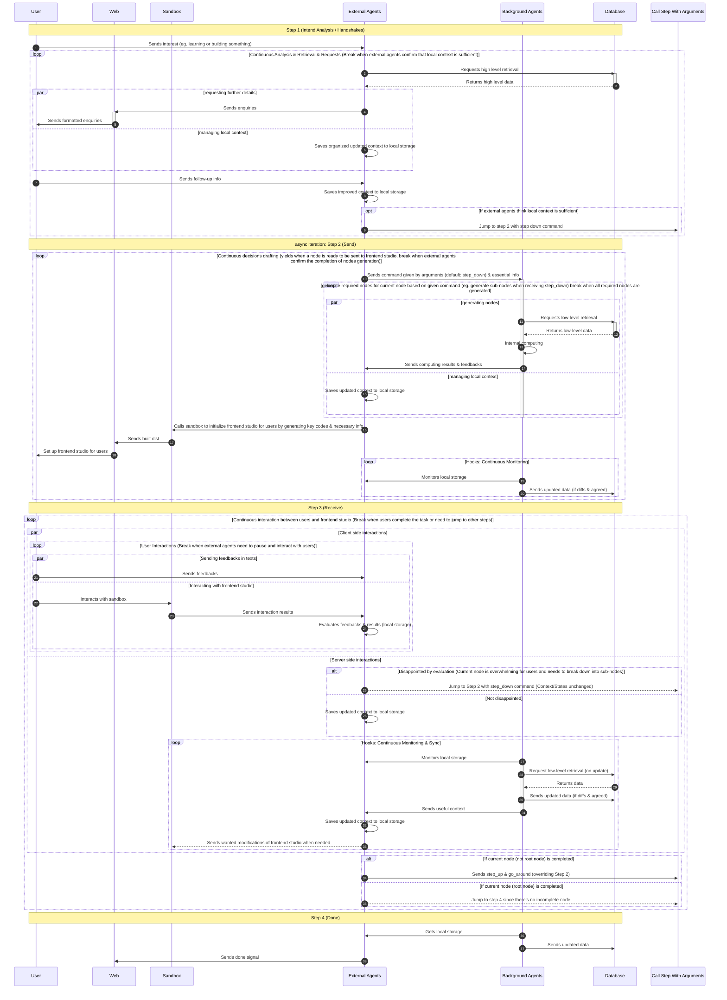
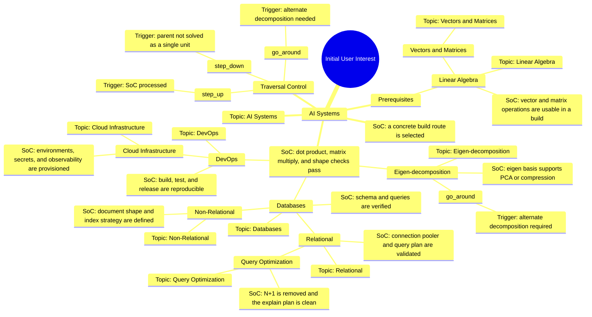

# **Overview**

- Different from traditional education strategies, this project emphasizes the
  importance of motivation-driven learning and gaining hands-on experience and
  advanced motivation through building projects. The learning path is designed
  as a tree structure, where each node represents a specific topic or skill.
  Users can choose their own learning path based on their interests and goals,
  and the system will provide personalized guidance and resources to help them
  achieve their objectives based on a top-to-down approach.

# **Philosophy**

- The core philosophy of this project is to encourage users to get rid of the
  current corrupted and inefficient education system and form a personalized
  comfort zone for learning and building. And finally achieve the real
  democratization of education and opportunities.
- ### What we are against:
  1. The overestimated significance of study
  2. The one-size-fits-all and extremely rigid and corrupted education system
  3. Education systems that are designed for the convenience of teachers and
     education bureaus rather than students
  4. The lack of hands-on experience and motivation-driven learning
  5. Some popular and widely accepted perspectives about learning and education
- ### What we are for:
  1. The underestimated significance of building and hands-on experience
  2. The personalized and flexible learning paths based on users' interests and
     goals
  3. Education systems that are designed for the convenience of students rather
     than teachers and education bureaus
  4. The importance of motivation-driven learning and it should be way more
     crucial than study
  5. Some unpopular but more accurate perspectives about learning and education
  6. Knowledge transition between people costs.
  7. The platform does not teach.
  8. It provides plans and routes for building.
  9. Anti-Bureau: the system optimizes for legibility, not ceremony.
  10. Motivation-driven: the system starts from intent, not content inventory.
  11. Hard blocks encountered during building are recursively materialized as
      child nodes.

# **Learning Tree**

- Root node: initial user interest.
- Generation strategy: BFS. Only the next level matters.
- Child nodes must fully represent all prerequisites of the current node.
- If a parent is too hard to take as a single unit, materialize children.
- If a parent is ok to take, do not generate children.
- Children divide hard nodes into easier independent nodes.
- The tree is the core product engine.

# **Node Contract**

| Field                     | Description                                                                            |
| ------------------------- | -------------------------------------------------------------------------------------- |
| Topic                     | The current unit of intent                                                             |
| Property                  | Mandatory or Optional                                                                  |
| Signs of Completion (SoC) | The hard boundary that defines when a node is realized                                 |
| Related Nodes             | Vague horizontal relations at similar tree depths, activated when user interest shifts |

# **Property semantics:**

- Mandatory: unskippable state, though it may be replaced by an equivalent
  alternative.
- Optional: not required individually, but a quota of optional nodes at a level
  can aggregate into a mandatory requirement.

# **Traversal triggers:**

- processed → step_up
- disappointed → step_down
- branch mismatch → go_around

# **Interaction**

The studio is a game loop: observe, choose, execute, verify, update.

Canonical flow: Intent Handshakes → Step_down → User Loop → Done

- step_down materializes when the current node cannot be accepted as a single
  unit.
- User Loop is the return path where the user continues decomposition or accepts
  the current node.
- Done only exists when the node returns a valid SoC.

# **Architecture**

- **Level 0**: Evaluation Engine: `Agent_Trace` → `Normalized_State`

- **Level 1**: Streaming Protocol: `Normalized_State` → `Delta_Event_Stream`

- **Level 2**: Studio Orchestrator: `Delta_Event` → `ReactFlow`, `R3F`, `GSAP`

- ### The layers stay pure by separating reduction, transport, and rendering.

## 2. Most Common Use Case

## 3. Best Practices Of Nodes Making Up A Tree

