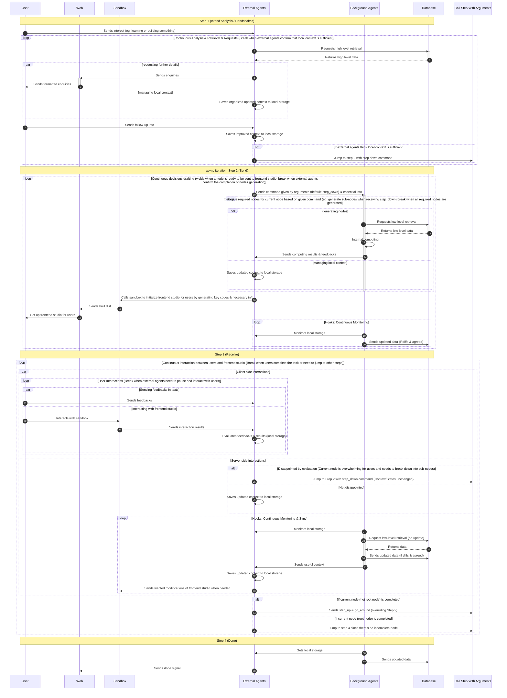

## 1. Most Common Use Case

```mermaid
sequenceDiagram
    autonumber
    participant c1 as User
    participant c2 as Web
    participant c3 as Sandbox
    participant c4 as External Agents
    participant c5 as Background Agents
    participant c6 as Database
    participant c7 as Call Step With Arguments

    Note over c1, c6: Step 1 (Intend Analysis / Handshakes)
    c1->>c4: Sends interest (eg. learning or building something)
    loop Continuous Analysis & Retrieval & Requests (Break when external agents confirm that local context is sufficient)
        c4->>c6: Requests high level retrieval
        activate c6
        c6-->>c4: Returns high level data
        deactivate c6
        par requesting further details
            c4->>c2: Sends enquiries
            activate c2
            c2->>c1: Sends formatted enquiries
            deactivate c2
        and managing local context
            c4->>c4: Saves organized updated context to local storage
        end
        c1->>c4: Sends follow-up info
        c4->>c4: Saves improved context to local storage
        opt If external agents think local context is sufficient
            c4->>c7: Jump to step 2 with step down command
        end
    end

    Note over c1, c6: async iteration: Step 2 (Send)
    loop Continuous decisions drafting (yields when a node is ready to be sent to frontend studio, break when external agents confirm the completion of nodes generation)
        c4->>c5: Sends command given by arguments (default: step_down) & essential info
        activate c5
        loop generate required nodes for current node based on given command (eg. generate sub-nodes when receiving step_down) break when all required nodes are generated
            par generating nodes
                c5->>c6: Requests low-level retrieval
                activate c6
                c6-->>c5: Returns low-level data
                deactivate c6
                c5->>c5: Internal computing
                c5->>c4: Sends computing results & feedbacks
            and managing local context
                c4->>c4: Saves updated context to local storage
            end
        end
        deactivate c5
        c4->>c3: Calls sandbox to initialize frontend studio for users by generating key codes & necessary info
        c3->>c2: Sends built dist
        c2->>c1: Set up frontend studio for users
        loop Hooks: Continuous Monitoring
            c5->>c4: Monitors local storage
            c5->>c6: Sends updated data (if diffs & agreed)
        end
    end

    Note over c1, c6: Step 3 (Receive)
    loop Continuous interaction between users and frontend studio (Break when users complete the task or need to jump to other steps)
        par Client side interactions
            loop User Interactions (Break when external agents need to pause and interact with users)
            par Sending feedbacks in texts
            c1->>c4: Sends feedbacks
            and Interacting with frontend studio
            c1->>c3: Interacts with sandbox
            c3->>c4: Sends interaction results
            c4->>c4: Evaluates feedbacks & results (local storage)
            end
            end
        and Server side interactions

        alt Disappointed by evaluation (Current node is overwhelming for users and needs to break down into sub-nodes)
            c4-->>c7: Jump to Step 2 with step_down command (Context/States unchanged)
        else Not disappointed
            c4->>c4: Saves updated context to local storage
        end

        loop Hooks: Continuous Monitoring & Sync
            c5->>c4: Monitors local storage
            activate c5
            c5->>c6: Request low-level retrieval (on update)
            c6-->>c5: Returns data
            c5->>c6: Sends updated data (if diffs & agreed)
            c5->>c4: Sends useful context
            deactivate c5
            c4->>c4: Saves updated context to local storage
            c4-->>c3: Sends wanted modifications of frontend studio when needed
        end
        end

        alt If current node (not root node) is completed
            c4->>c7: Sends step_up & go_around (overriding Step 2)
        else If current node (root node) is completed
            c4-->>c7: Jump to step 4 since there's no incomplete node
        end
    end

    Note over c1, c6: Step 4 (Done)
    c5->>c4: Gets local storage
    c5->>c6: Sends updated data
    c4->>c2: Sends done signal
```
